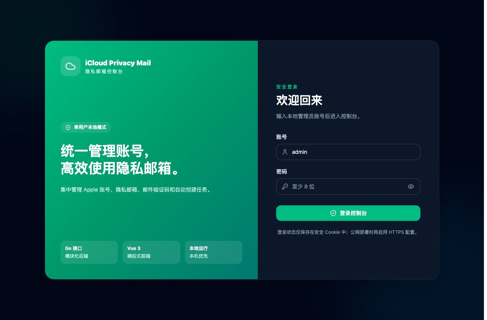
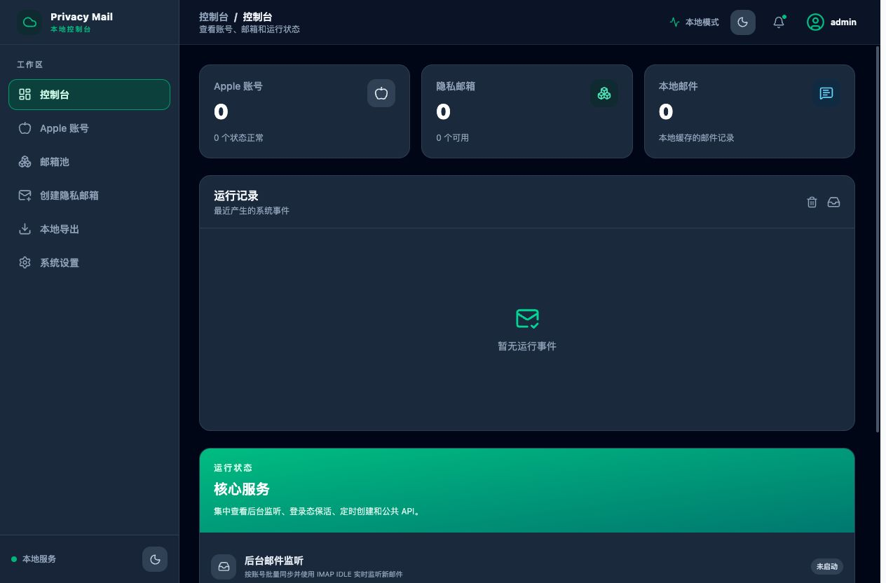
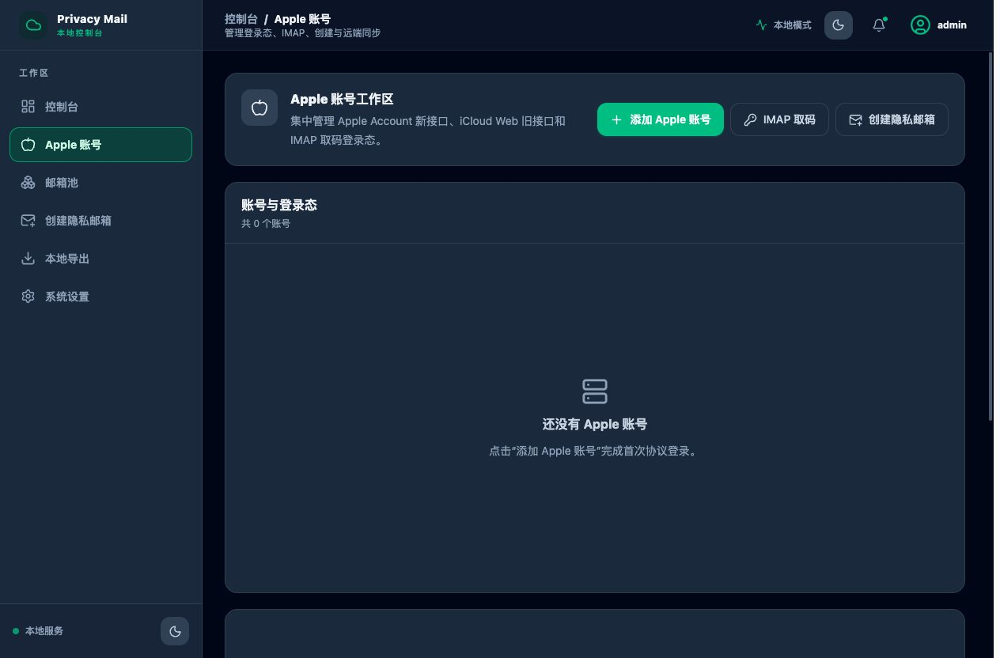
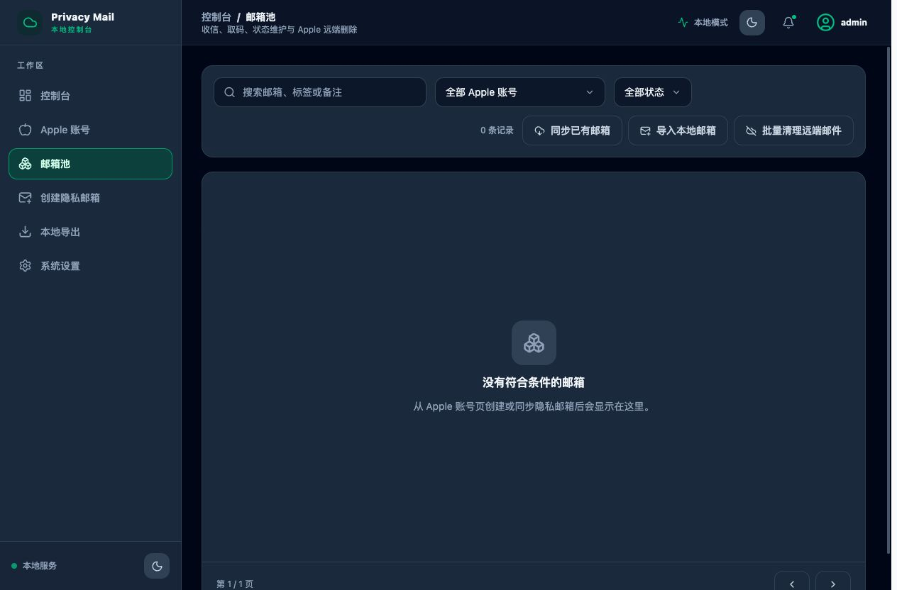
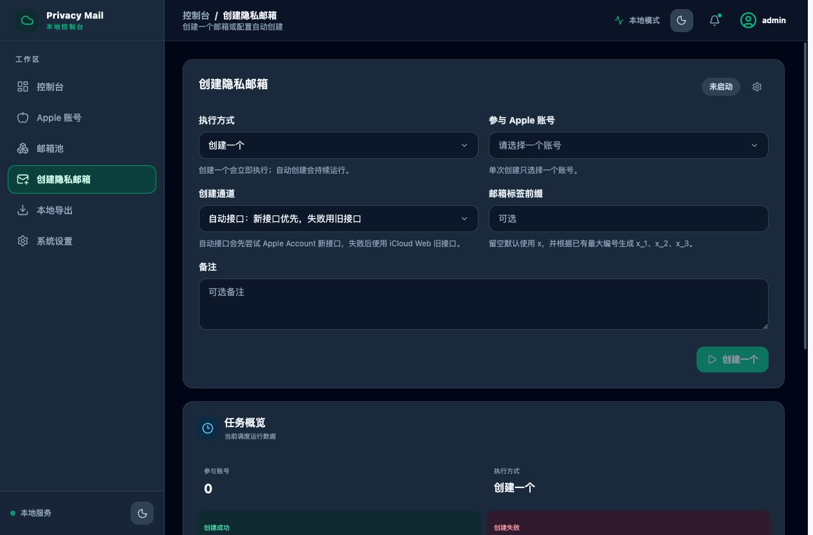
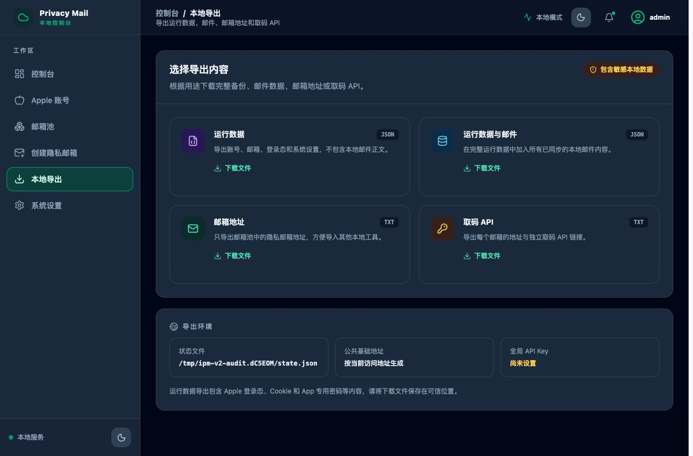
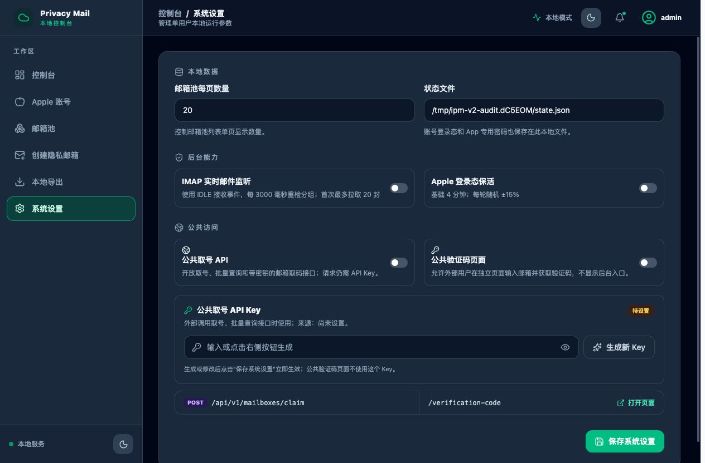

# iCloud Privacy Mail

单管理员、本地优先的 Apple 隐私邮箱管理工具。后端使用 Go，管理页面使用 Vue 3，支持 Apple/iCloud 登录、IMAP、隐私邮箱、验证码、自动创建、公共接口和本地导出。

项目参考 [q1953258942/iCloud-Privacy-Mail](https://github.com/q1953258942/iCloud-Privacy-Mail) 的协议和数据处理思路，在独立目录中重新组织后端模块并重建前端页面。

## 主要功能

- Apple Account 新接口、iCloud Web 旧接口登录和两步验证。
- iCloud IMAP App 专用密码、IDLE 监听、邮件同步和验证码提取。
- 隐私邮箱创建、同步、导入、筛选、状态、远端清理和远端删除。
- 邮箱池支持点击邮箱复制、标签/备注双行展示、备注与状态快捷编辑，以及带二次确认的串行删除队列。
- 单次创建与多账号自动创建，默认生成 `x_1`、`x_2` 等连续标签。
- 公共取号 API、邮箱独立取码 API、独立公共验证码页面。
- 运行数据、邮件、邮箱地址和取码 API 本地导出。
- GitHub Release/默认分支版本检查、侧栏版本展示和顶部公告中心。
- 单管理员登录保护；无多用户注册和 `/manage` 页面。

## 快速启动

要求 Go 1.25 或更高版本，以及满足 Vite 8 要求的 Node.js/npm。

```bash
cp config.example.json config.json
./scripts/build.sh
go run main.go
```

无参数执行时会显示中文启动菜单。默认访问地址：

```text
http://127.0.0.1:8788/
```

项目没有默认密码。首次打开页面时创建唯一的本地管理员，之后使用该账号登录。

直接按配置启动：

```bash
go run main.go -config config.json
```

运行已构建程序：

```bash
./bin/ipm-server -config config.json
```

开发模式：

```bash
./scripts/dev.sh
```

Vue 开发地址为 `http://127.0.0.1:5174/`，Go API 地址为 `http://127.0.0.1:8788/`。

`go run main.go` 使用 `internal/webui/dist` 中的 Go 内嵌前端资源，不会直接读取 `frontend/src`。修改前端后如果要在 `http://127.0.0.1:8788/` 查看效果，请在项目根目录执行：

```bash
npm --prefix frontend run build
./scripts/sync-web.sh
go run main.go
```

## 页面

| 路由 | 功能 |
| --- | --- |
| `/login` | 首次创建管理员、后续登录 |
| `/` | 账号、邮箱、邮件统计，运行记录和后台状态 |
| `/apple-accounts` | Apple 登录、2FA、登录态检测、IMAP、创建和同步 |
| `/mailboxes` | 搜索筛选、点击复制、快捷编辑、详情、邮件、取码、远端清理和串行彻底删除 |
| `/tasks` | 创建一个邮箱、自动创建、默认值和调度日志 |
| `/exports` | 运行数据、邮件、邮箱和 API 导出 |
| `/settings` | 本地数据、后台能力、公共访问、API Key 和版本检查 |
| `/verification-code` | 面向外部用户的独立公共验证码页面 |

所有空数据页面截图、逐页操作说明、接口、配置、结构和技术栈见 [完整项目指南](PROJECT_GUIDE.md)。

## 页面截图

以下截图来自隔离的空数据实例，只包含浏览器页面，不含真实 Apple 账号、邮箱、Cookie、密码或邮件。

### 登录页



### 控制台



### Apple 账号



### 邮箱池



### 创建隐私邮箱



### 本地导出



### 系统设置



### 公共验证码页面


## 项目结构

```text
iCloud-Privacy-Mail-v2/
├── main.go                  # Go 服务主入口和中文启动菜单
├── cmd/migrate/             # 旧状态迁移工具
├── internal/
│   ├── auth/                # 单管理员和会话
│   ├── buildinfo/           # 二进制版本、提交和构建信息
│   ├── apple/               # Apple 登录态和保活
│   ├── mailbox/             # 邮箱、邮件、验证码和远端操作
│   ├── mailwatcher/         # IMAP IDLE 和批量同步
│   ├── scheduler/           # 自动创建调度
│   ├── protocol/            # Apple、iCloud、IMAP 协议客户端
│   ├── store/               # schema 3 JSON 状态存储
│   ├── updatecheck/         # GitHub 版本检查与项目公告
│   ├── httpapi/             # 管理 API、公共 API 和导出
│   └── webui/               # Go 嵌入式前端资源
├── frontend/                # Vue 3 + Vue Router + Tailwind CSS
├── scripts/                 # 开发、构建和资源同步
├── docs/                    # 架构、迁移、审计和页面截图
├── PROJECT_GUIDE.md         # 完整使用与技术文档
└── config.example.json
```

## 版本检查与公告

左侧导航底部显示当前版本和构建提交。进入“系统设置 → 版本与更新”可以检查 `update_repository` 对应仓库的最新 GitHub Release；仓库没有 Release 时会比较默认分支的最新提交。顶部铃铛显示版本消息和项目公告，已读状态只保存在当前浏览器。

当前功能只负责检查和打开 GitHub 页面，不会下载或替换正在运行的程序。项目公告维护在 `internal/updatecheck/announcements.json`，远端内容按纯文本显示。完整构建脚本会把版本、Git commit 和构建时间写入二进制；在 Git tag 上构建时使用 tag 作为版本号，也可以通过 `IPM_VERSION` 指定版本。

## 数据迁移

```bash
./bin/ipm-migrate \
  -source /PATH/TO/OLD/data/state.json \
  -target data/state.json
```

迁移工具会导入管理员、Apple 账号、邮箱、邮件、创建设置和 Apple 登录态，并升级到 schema 3。旧 Web 会话不会迁移，迁移后需要重新登录。覆盖已存在目标时先备份，再增加 `-force`。

## 数据与安全

状态默认保存在 `data/state.json`，包含 Apple Cookie、登录态、IMAP App 专用密码、邮箱 API Token 和公共 API Key。程序以 `0600` 权限保存状态文件；`config.json` 中写入 Key 后也建议执行：

```bash
chmod 600 config.json
```

默认配置面向本机使用。公网部署前需要完成 Host 校验、HTTPS、Secure Cookie、Origin/CSRF 校验、登录与公共接口限流、公共验证码访问控制和敏感状态加密。

最新代码审计、风险等级、扫描结果和修复顺序见 [代码与安全审计](docs/07-代码与安全审计.md)。

## 文档

- [完整项目指南](PROJECT_GUIDE.md)
- [代码与安全审计](docs/07-代码与安全审计.md)
- [迁移指南](docs/04-迁移指南.md)
- [项目结构](docs/05-项目结构.md)
- [重构总结](REFACTOR_SUMMARY.md)
