# iCloud Privacy Mail

> 项目来源：[xiuxiu56/iCloud-Privacy-Mail-v2](https://github.com/xiuxiu56/iCloud-Privacy-Mail-v2)

单管理员、本地优先的 Apple 隐私邮箱管理工具。后端使用 Go，前端使用 Vue 3，业务数据统一存入 SQLite，并通过 SSE 将账号、邮箱、邮件、任务和运行事件实时同步到已登录页面。

当前项目源码、文档、发行版本和后续更新均以 GitHub 项目来源仓库为准。

## 主要功能

- Apple Account 新接口、iCloud Web 旧接口登录、两步验证、登录态检测与后台保活。
- iCloud IMAP App 专用密码验证、IMAP IDLE 监听、按账号批量同步、验证码提取与点击复制。
- 隐私邮箱创建、远端同步、手动导入、搜索筛选、状态和备注编辑。
- 邮箱池按浏览器可视高度自动计算分页容量，支持表格多选、详情、取码和邮箱地址点击复制。
- 全量 Apple 邮件清理、按目标邮箱清理、单个或批量彻底删除邮箱；后台队列独立执行并持续显示账号、邮箱和完成进度。
- 单次创建与多账号自动创建；轮次间隔和账号间隔均支持随机范围，创建失败时自动停止。
- 公共取号租约 API、邮箱独立取码 API、公共验证码页面。
- 运行数据、邮件、邮箱地址和取码 API 本地导出。
- SQLite WAL、敏感字段 AES-GCM 加密、在线备份、完整性检查、空间整理和保留期清理。
- SSE 事件序号、持久化变更日志、断线回放、心跳和页面自动刷新。
- GitHub Release/默认分支版本检查、侧栏版本信息与公告中心。
- 单管理员登录保护；无多用户注册和 `/manage` 页面。

## 快速启动

`go.mod` 的最低 Go 版本为 1.25。由于本次依赖扫描发现 Go 1.26.5 标准库存在已修复漏洞，实际构建推荐使用 Go 1.26.6 或更新的补丁版本。前端需要满足 Vite 8 要求的 Node.js/npm。

```bash
cp config.example.json config.json
./scripts/build.sh
go run main.go
```

无参数执行时会显示中文启动菜单。默认访问地址：

```text
http://127.0.0.1:8788/
```

项目没有默认密码。首次打开页面时创建唯一的本地管理员，之后使用该账号登录。

常用命令：

```bash
# 直接按配置启动
go run main.go -config config.json

# 运行构建产物
./bin/ipm-server -config config.json

# 前后端开发模式
./scripts/dev.sh
```

开发模式下 Vue 地址为 `http://127.0.0.1:5174/`，Go API 地址为 `http://127.0.0.1:8788/`。

`go run main.go` 使用 `internal/webui/dist` 中的嵌入式资源。修改 `frontend/src` 后若要在 8788 端口查看新页面，请执行：

```bash
npm --prefix frontend run build
./scripts/sync-web.sh
go run main.go
```

## 新版页面

新版 UI 采用紧凑型侧栏、统一卡片与表格、等高控件和响应式分页。下列截图由当前仓库源码重新构建，并从隔离演示实例采集，只包含 `demo.*` 示例数据，不含真实 Apple 账号、Cookie、密码、Token 或邮件。

### 登录与控制台

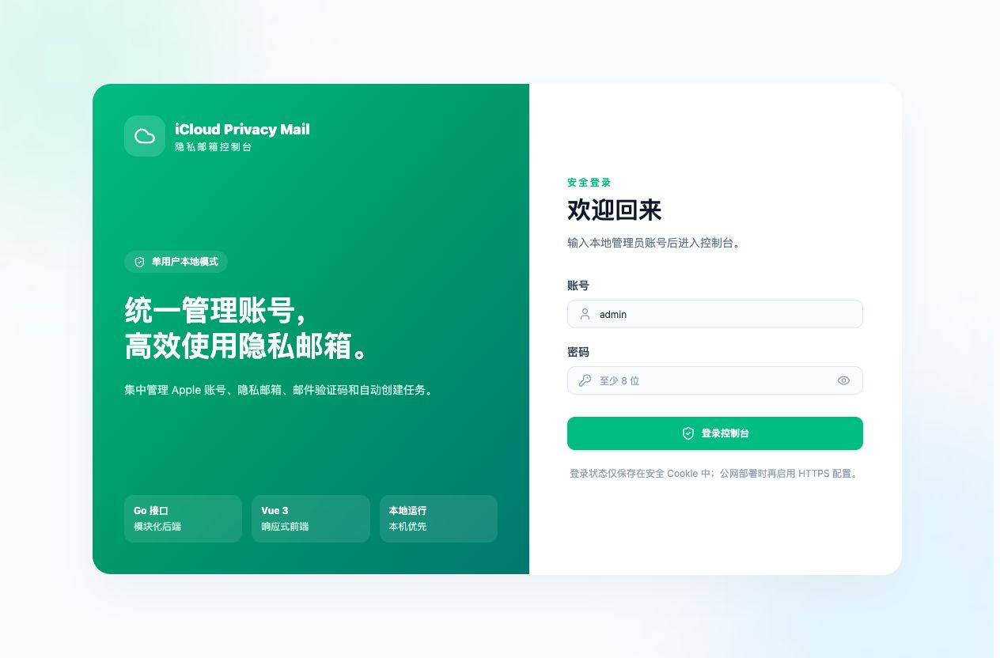

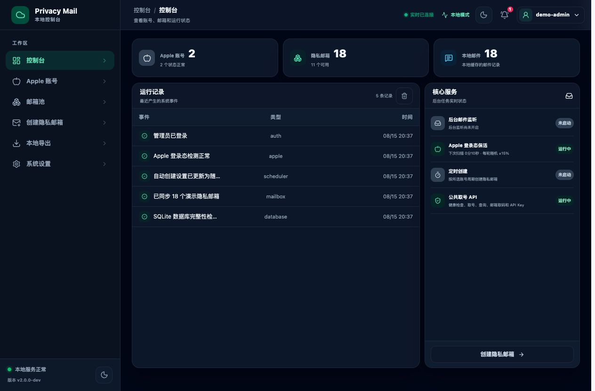

控制台展示 Apple 账号、隐私邮箱、邮件和后台能力汇总；运行记录使用与调度日志一致的紧凑表格，内容按列居中，表底与浏览器底部间距会随可显示行数调整。

### Apple 账号

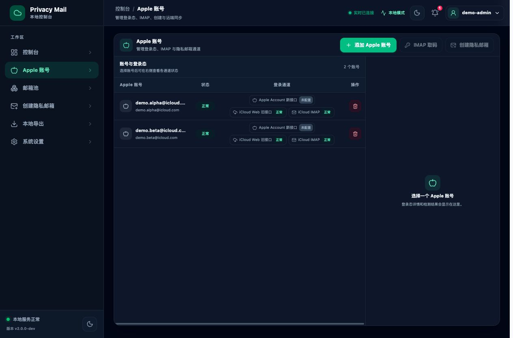

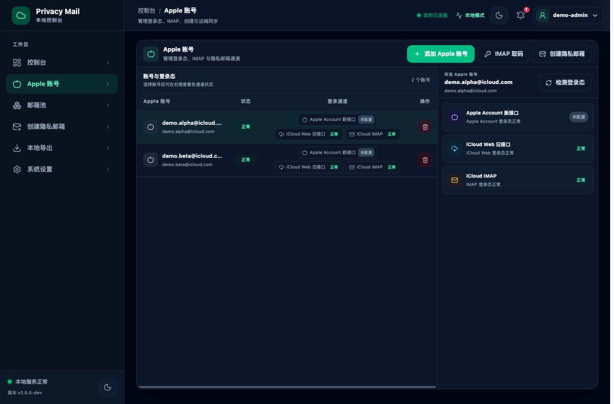

点击账号整行即可打开登录态详情和检测结果。页面集中提供 Apple Account、iCloud Web、IMAP 的登录、检测、保存、创建与同步入口。

### 邮箱池

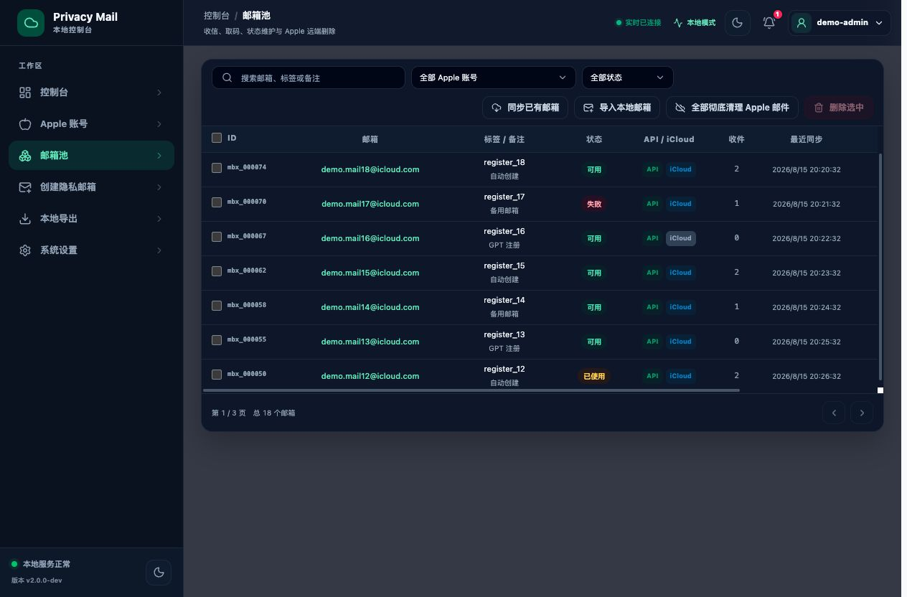

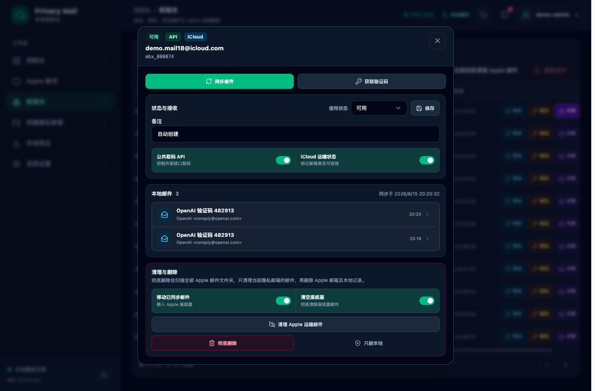

表格支持 ID 和复选框、邮箱点击复制、标签/备注、状态、API/iCloud、收件数和最近同步。每行同步、取码或删除只影响当前任务，不会连带禁用其他无关按钮。

### 创建隐私邮箱

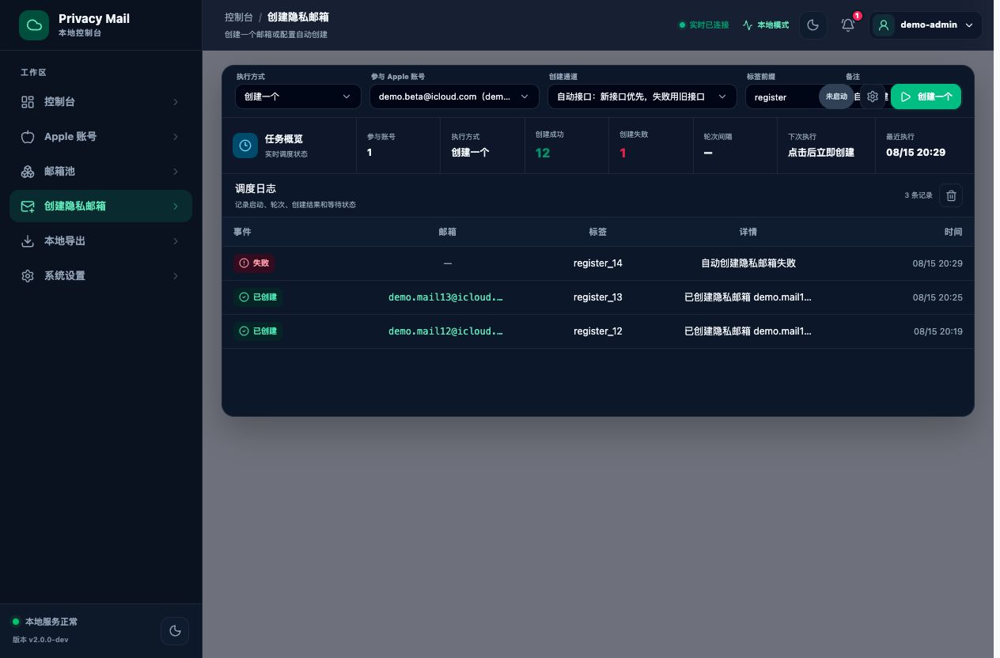

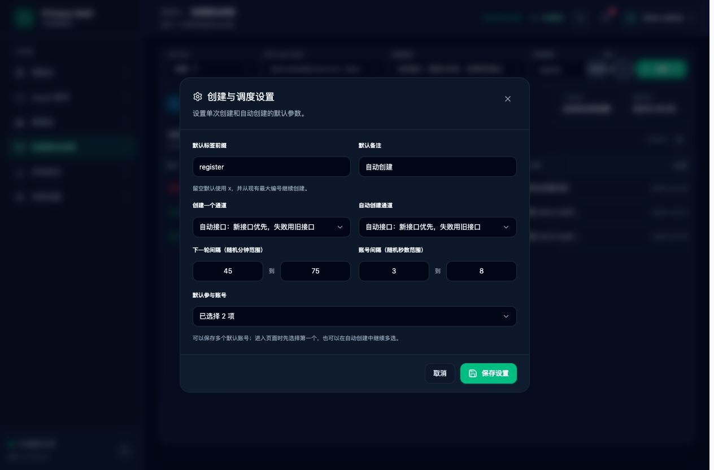

创建页支持单次与自动执行。设置弹窗使用“最小值—最大值”普通文本输入框配置下一轮随机分钟范围和账号随机秒数范围，不显示数字输入框的上下调节按钮。

### 导出、设置与公共取码

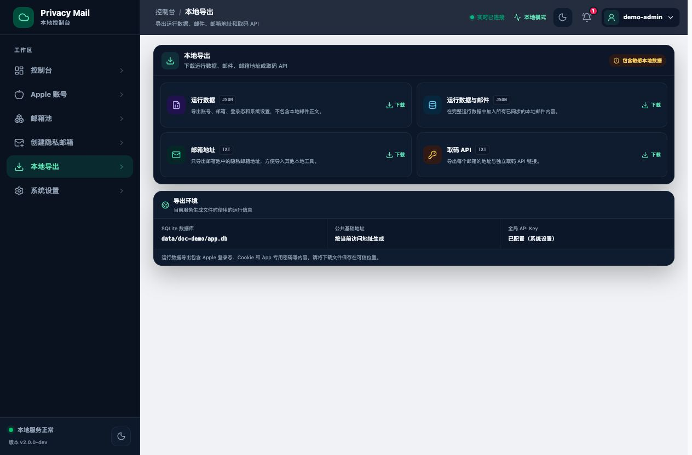

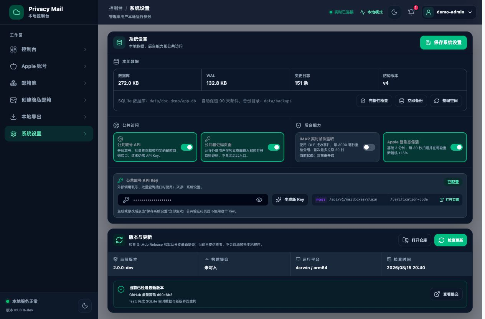

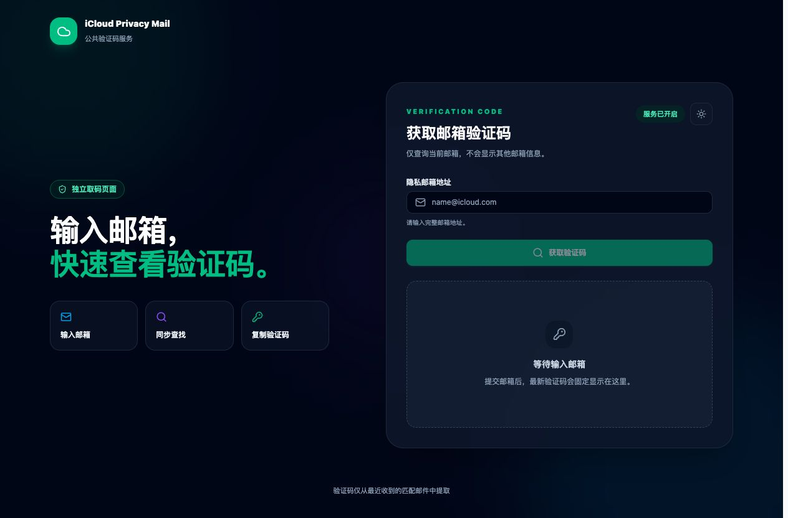

## 页面路由

| 路由 | 功能 |
| --- | --- |
| `/login` | 首次创建管理员、后续登录 |
| `/` | 账号、邮箱、邮件统计，运行记录和后台状态 |
| `/apple-accounts` | Apple 登录、2FA、登录态详情与检测、IMAP、创建和同步 |
| `/mailboxes` | 搜索筛选、多选、详情、取码、邮件清理和邮箱删除 |
| `/tasks` | 单次创建、自动创建、随机调度设置和调度日志 |
| `/exports` | 运行数据、邮件、邮箱地址和 API 导出 |
| `/settings` | SQLite 维护、后台能力、公共访问、API Key 和版本检查 |
| `/verification-code` | 面向外部调用者的公共验证码页面 |

逐页操作说明见 [完整项目指南](PROJECT_GUIDE.md)。

## SQLite 与实时更新

`data/app.db` 是唯一业务数据源，服务不再读取或生成 `state.json`。数据库启用 WAL、关系约束、事务和原生 SQL 分页；Apple Cookie、登录态、IMAP App 专用密码、邮箱 API Token 和公共 API Key 使用 `data/app.db.key` 进行 AES-GCM 加密。

数据库、密钥和配置文件使用 `0600`，数据目录使用 `0700`。在线备份会同时生成 `.db` 与 `.db.key`，恢复时必须成对使用。系统设置页提供：

- 数据库状态与 schema 版本。
- 完整性检查。
- 在线备份。
- WAL checkpoint 与空间整理。
- 默认 90 天邮件保留和 14 天备份保留。

前端登录后连接 `GET /api/realtime`。服务把变化写入 `change_log` 并发送递增事件序号；浏览器通过 `Last-Event-ID` 断线续传，收到对应主题后只刷新受影响页面。SSE 断开不影响业务操作，页面仍可通过普通 API 加载数据。

## Apple 邮件清理与邮箱删除

“全部彻底清理 Apple 邮件”按 Apple 账号扫描全部远端邮件文件夹，统一把 Apple 内部文件夹名转换成中文展示，并显示：

```text
Apple 账号 N｜邮箱 M｜执行中 X｜排队中 Y｜已完成 A/M（成功 B，失败 C）
```

邮件为空时仍会完成账号扫描，发现数、移入废纸篓数和彻底删除数均显示为 0。按邮箱清理只处理目标隐私邮箱收到的邮件；彻底删除邮箱会先清理该邮箱的远端邮件，再删除 Apple 云端邮箱，远端确认成功后才删除本地记录。

批量任务使用独立队列。点击一个同步、清理、取码或删除按钮时，只禁用当前行或同一资源上冲突的操作，其他账号和邮箱仍可继续操作。

## 公共邮箱租约

`POST /api/v1/mailboxes/claim` 执行 `available → reserved`，响应返回 `mailbox` 和 `lease`。调用方应为一个业务请求提供稳定的 `request_id`，服务会按 `project + request_id` 返回同一租约，避免超时重试重复消耗邮箱。

```text
注册成功       POST /api/v1/mailbox-leases/{lease_id}/commit
注册失败       POST /api/v1/mailbox-leases/{lease_id}/release
等待人工确认   POST /api/v1/mailbox-leases/{lease_id}/renew
更新备注       POST /api/v1/mailbox-leases/{lease_id}/note
查询租约       GET  /api/v1/mailbox-leases/{lease_id}?project=PROJECT
```

`commit` 才会执行 `reserved → used`；`release` 和超时回收会恢复为 `available`。生产调用推荐使用 `X-API-Key` 或 `Authorization: Bearer TOKEN` 请求头，不要把 Key 放入 URL 查询参数。

## 项目结构

```text
iCloud-Privacy-Mail-v2/
├── main.go                  # Go 服务主入口和中文启动菜单
├── internal/
│   ├── auth/                # 单管理员和会话
│   ├── apple/               # Apple 登录态和保活
│   ├── mailbox/             # 邮箱、邮件、验证码和远端操作
│   ├── mailwatcher/         # IMAP IDLE 与批量同步
│   ├── scheduler/           # 自动创建调度、日志和恢复
│   ├── protocol/            # Apple、iCloud、IMAP 协议客户端
│   ├── store/               # SQLite、字段加密、事务和变更日志
│   ├── httpapi/             # 管理 API、公共 API、SSE 和数据库维护
│   └── webui/               # Go 嵌入式前端资源
├── frontend/                # Vue 3 + Vue Router + Tailwind CSS
├── scripts/                 # 开发、构建和资源同步
├── docs/                    # 架构、维护、审计和新版截图
├── PROJECT_GUIDE.md         # 完整使用与技术文档
└── config.example.json
```

## 安全提示

本地使用建议保持 `host=127.0.0.1`，公共取号和公共验证码按需启用。直接部署到公网前，至少应完成 Host allowlist、HTTPS、`secure_cookie=true`、登录和公共接口限流、管理写接口 Origin/CSRF 校验、公共验证码访问控制及可信反向代理配置。

本次审计确认 Go 1.26.5 标准库存在 5 条代码可达漏洞，均标记在 Go 1.26.6 修复，因此推荐升级 Go 后重新构建。完整扫描结果、人工复核和修复优先级见 [代码与安全审计](docs/07-代码与安全审计.md)。

## 文档

- [完整项目指南](PROJECT_GUIDE.md)
- [代码与安全审计](docs/07-代码与安全审计.md)
- [SQLite 升级与恢复](docs/04-迁移指南.md)
- [项目结构](docs/05-项目结构.md)
- [重构总结](REFACTOR_SUMMARY.md)
